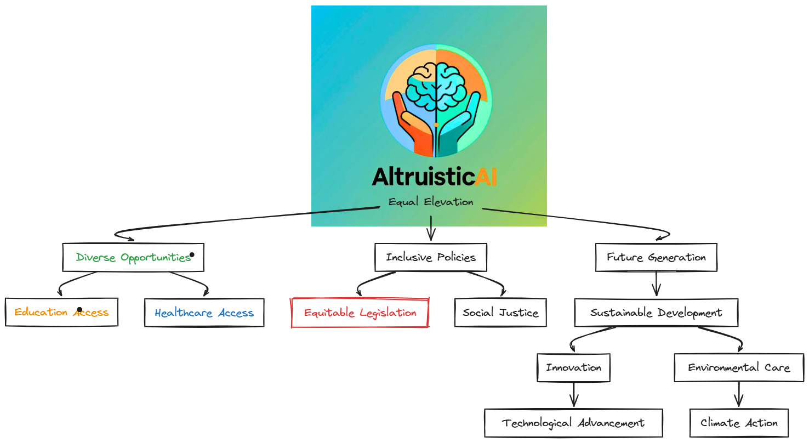

---
vars:
  Landing: Landing Page
description: Maine’s Independent AI Lab
icon: lightbulb-on
coverY: 0
layout: landing
---

# Altruistic AI


<mark style="color:purple;background-color:purple;">Use underlined text for annotations providing extra information.<mark style="color:purple;background-color:purple;">


This platform is an ongoing <mark style="color:purple;">experiment</mark>. We leverage semantic AI to solve real-world challenges, focusing on the vital question:

[<mark style="color:purple;">Can interdisciplinary AI tackle foundational issues more efficiently than traditional methods?</mark>](#user-content-fn-1)[^1]

We are in the <mark style="color:purple;">planning stage,</mark> piloting this initiative with institutions such as UNE (University of New England). It is available to any university or organization interested in innovation.

***

[What We’re Explorin](#user-content-fn-2)[^2]g

[Target Audience](#user-content-fn-3)[^3]

A Story & Our 'Why'

***

👉 <mark style="color:purple;">Want to join the experiment?</mark> <mark style="color:blue;">📩</mark> <mark style="color:purple;">alienxinnovation@gmail.com |</mark> <mark style="color:blue;">🌐</mark> [<mark style="color:purple;">altruisticxai.org</mark>](https://www.altruisticxai.org/)

<mark style="background-color:purple;">An Invitation to Collaborate on a Live AI Deployment</mark>

<figure><figcaption></figcaption></figure>

[^1]: Interdisciplinary AI integrates methods from computer science, neuroscience, cognitive science, and social sciences to solve complex problems. This approach leverages diverse perspectives, providing innovative solutions and addressing foundational issues that traditional methods might miss. By uniting multiple disciplines, interdisciplinary AI fosters a comprehensive understanding of intricate challenges, leading to more efficient and holistic solutions.

[^2]: * AI that learns **fast** in specific domains (not generic LLMs)

    - Community-scale deployment models

    * Generalists and experts collaborating to solve real problems

    - Replacing “band-aid tech” with testable, sustainable systems

[^3]: * Research institutions

    - Universities expanding in AI, energy, EMS, and edtech

    * Programs focused on student-centric, community-driven innovation
